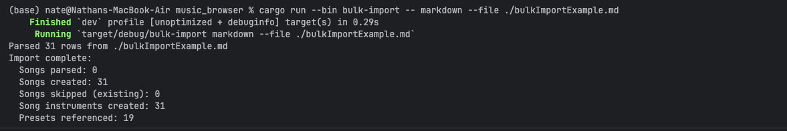

# Personal Music Browser

[](https://github.com/asteroidDavis/PersonalMusicBrowser/actions/workflows/ci.yml)

A lightweight music production planning app built with **Rust**, **Actix-web**, **Askama** templates, and **SQLite** (via SQLx).

## Model Diagram

```
┌──────────────┐       ┌──────────────┐       ┌─────────────┐
│  Instrument   │       │     Band     │       │    Album    │
├──────────────┤       ├──────────────┤       ├─────────────┤
│ id      (PK) │       │ id    (PK)   │       │ id    (PK)  │
│ name         │       │ name         │       │ title       │
│ inst_type    │       └──────┬───────┘       │ released    │
└──────┬───────┘              │               │ url         │
       │               ┌──────┴───────┐       └──────┬──────┘
       │               │ artist_bands │              │
       │               │  (M2M join)  │              │
       │               └──────┬───────┘              │
       │                      │                      │
       │               ┌──────┴───────┐              │
       │               │    Artist    │              │
       │               └──────┬───────┘              │
       │                      │                      │
       │               ┌──────┴───────┐              │
       │               │ song_artists │              │
       │               └──────┬───────┘              │
       │                      │               FK (nullable)
       │               ┌──────┴───────┐◄─────────────┘
       │               │     Song     │
       │               ├──────────────┤
       │               │ id     (PK)  │     ┌──────────────┐
       │               │ title        │     │    Device    │
       │               │ album_id(FK) │     ├──────────────┤
       │               │ song_type*   │     │ id     (PK)  │
       │               │ key          │     │ name         │
       │               │ bpm_lower    │     │ device_type  │
       │               │ bpm_upper    │     │ manual_path  │
       │               │ original_art │     │ notes        │
       │               │ score_url    │     └──────┬───────┘
       │               │ description  │            │
       │               └──────┬───────┘     ┌──────┴───────┐
       │                      │             │DevicePreset  │
       │   ┌──────────┬───────┼─────┬───────┤preset_code   │
       │   │          │       │     │       └──────┬───────┘
       │   ▼          ▼       ▼     ▼              │
       │ Recording  Cover  Comp  SongInstrument◄───┘ (M2M)
       │            Detail Detail   │
       │                          has presets
       │
       │   Song also has:
       │    ├── ProductionStage (1:M) ── ProductionStep (1:M)
       │    ├── SongFile (1:M)
       │    └── SongInstrument (1:M) ── DevicePreset (M2M)
       │
       │   Standalone:
       │    └── Sample ── Instrument (M2M)
       │
  Instrument is linked via M2M to Recording, Cover, Composition,
  SongInstrument, ProductionStep, SongFile, and Sample.
```

*Song types: `song`, `cover`, `composition`, `original`, `practice`

### Entity Summary

| Entity | Description |
|---|---|
| **Instrument** | A musical instrument with type (guitar, bass, piano, drums, etc.) |
| **Band** | A named group of artists |
| **Artist** | A musician; belongs to zero or more Bands |
| **Album** | A collection of songs; has released status and URL |
| **Song** | A track; type is `song`, `cover`, `composition`, `original`, or `practice`. Album is optional. |
| **CoverDetail** | Extra fields for cover songs (notes image, completion status, instruments) |
| **CompositionDetail** | Extra fields for compositions (BPM range, instruments) |
| **Recording** | A recorded file for a song (type: audacity, mix, master, loop-core-list, wav, daw-project, practice) |
| **Device** | A physical device (pedal, amp, synth, interface, daw, other) |
| **DevicePreset** | A named preset/program change on a Device |
| **SongInstrument** | Per-song instrument config with linked presets, score URL, production/mastering paths |
| **ProductionStage** | A production phase for a song (tracking, mixing, mastering, etc.) with status |
| **ProductionStep** | An individual step within a stage, optionally tied to an instrument |
| **SongFile** | A file associated with a song (score, daw_project, audio, etc.) |
| **Sample** | A reusable audio sample with optional BPM, key, and linked instruments |

## Prerequisites

- **Rust** (stable toolchain): https://rustup.rs
- **SQLx CLI** (for migrations):
  ```bash
  cargo install sqlx-cli --no-default-features --features sqlite
  ```

## Quick Start
with an empty database

```bash
cd music_browser

# Create the database and run migrations
cp .env.example .env          # or create: echo 'DATABASE_URL=sqlite:music_browser.db' > .env
sqlx database create
sqlx migrate run --source ./migrations

# Build and run
cargo run --bin music-browser
# App is at http://127.0.0.1:3000
```

## Environment Variables

| Variable | Default | Description |
|---|---|---|
| `DATABASE_URL` | `sqlite:music_browser.db` | SQLite connection string |
| `BIND_ADDR` | `127.0.0.1:3000` | Address to bind the server |
| `RUST_LOG` | `info` | Log level (trace, debug, info, warn, error) |
| `JOB_STORE_CAP` | `10` | Max job records retained in memory before eviction |
| `JOB_STORE_TTL_SECS` | `7200` | TTL (seconds) for job records before eviction |
| `HYDRATION_TIMEOUT_SECS` | `30` | Wait time (seconds) for cloud placeholder hydration before fallback copy |
| `HYDRATION_COPY_MAX_BYTES` | `1073741824` | Max bytes allowed for temp copy fallback (0 disables limit) |

## Database

### Log in / Inspect the Database

```bash
# Using the sqlite3 CLI (ships with macOS):
sqlite3 music_browser/music_browser.db

# Useful commands inside sqlite3:
.tables              -- list all tables
.schema songs        -- show CREATE TABLE for songs
SELECT * FROM songs; -- query data
.quit                -- exit
```

### Apply Migrations

Migrations live in `music_browser/migrations/`. To apply:

```bash
cd music_browser
sqlx migrate run --source ./migrations
```

To add a new migration:

new database
```bash 
sqlx migrate add -r <description> --source ./migrations
# Edit the generated .sql file, then run:
sqlx migrate run --source ./migrations
```

update existing database
```
BACKUP_DEST="TODO/ApplicationBackups/"
LATEST_MIGRATION=$(ls migrations/*.sql | tail -1 | grep -o '[0-9]\+')
TIMESTAMP=$(date +%Y%m%d_%H%M%S)
cp ./music_browser.db ${BACKUP_DEST}/music_browser_${LATEST_MIGRATION}_${TIMESTAMP}.db 
sqlx migrate run --source ./migrations --database-url sqlite:music_browser.db
```

## Bulk Import

The `bulk-import` CLI tool imports data from markdown tables or another SQLite database.

### From Markdown

Import cover song setups from a markdown file containing pipe-delimited tables
with instrument sections headed by `**Guitar Songs**`, `**Bass Songs**`, or `**Piano Songs**`.

```bash
cd music_browser

# Dry run (parse and print, no database writes)
cargo run --bin bulk-import -- markdown --file ../"Cover song setup CC, PC, and preset codes 1.md" --dry-run

# Import for real
cargo run --bin bulk-import -- markdown --file ../"Cover song setup CC, PC, and preset codes 1.md"
```

**What it does:**
- Parses each table row into a song (type: cover) with instrument section
- Creates songs (skips if title already exists)
- Creates instruments (Guitar, Bass, Piano) if missing
- Creates devices (Ultrawave, Plethora X5, POG2) and their presets from the table columns
- Links everything via `song_instruments` and `song_instrument_presets`

**Expected markdown format:**

```markdown
**Guitar Songs**

| Song | Ultrawave program changes | Plethora program changes | POG2 presets | Other enumerated changes | Description | Score |
| --- | --- | --- | --- | --- | --- | --- |
| My Song | PC1 | PC8 | None | STRAT_POS3 | A description | [score](https://example.com) |

**Bass Songs**

| id | Song | Ultrawave program changes | Plethora program changes | POG2 presets | Other enumerated changes | Score |
| --- | --- | --- | --- | --- | --- | --- |
| 1 | Bass Song | None | None | None | PBASS_T10 | [score](https://example.com/bass) |
```
**What it looks like**



### From SQLite

Copy rows from another SQLite database, skipping duplicates by name/title:

```bash
# Dry run
cargo run --bin bulk-import -- sqlite --file /path/to/source.db --dry-run

# Import
cargo run --bin bulk-import -- sqlite --file /path/to/source.db
```

**What it does:**
- Attaches the source database
- Copies instruments, bands, artists, albums (by name/title, skipping existing)
- Copies songs (by title, using only columns that exist in both source and target)
- Detaches the source database

### Import Checklist

- [ ] Back up your database before importing: `cp music_browser.db music_browser.db.bak`
- [ ] Run with `--dry-run` first to preview what would be imported
- [ ] Run the actual import
- [ ] Verify with `sqlite3 music_browser.db "SELECT COUNT(*) FROM songs;"`
- [ ] Start the web server and spot-check the imported data

## Testing

### Run All Tests (terminal)

```bash
cd music_browser
cargo test
```

### Run a Single Test (terminal)

```bash
cargo test test_song_crud           # by name substring
cargo test test_song_crud -- --exact # exact match
```

### Run Tests in JetBrains (CLion / IntelliJ + Rust plugin)

1. Open the `music_browser` directory as a project (or the parent repo).
2. In `tests/db_tests.rs`, click the green ▶ gutter icon next to any `#[tokio::test]` function.
3. Or right-click a test function → **Run 'test_name'**.
4. To run all tests: open the terminal tab and run `cargo test`.

### Test Coverage

The test suite covers:

**Database schema tests** (`tests/db_tests.rs` — 29 tests):
- Migration creates all 22 expected tables
- CRUD for instruments (with type), bands, artists, albums, songs, recordings
- Songs with and without albums (nullable album_id)
- New song fields: key, bpm_lower/upper, original_artist, score_url, description
- Expanded song types: song, cover, composition, original, practice
- Expanded recording types: audacity, mix, master, loop-core-list, wav, daw-project, practice
- Device CRUD with type constraints and preset cascade deletion
- Song instruments with device preset links (M2M)
- Production stages with unique constraint and step cascades
- Song files with file_type constraints
- Sample CRUD with instrument links
- FK constraints: album delete → SET NULL on songs, recording RESTRICT on song delete
- Song instrument cascade on song delete

**Bulk import tests** (`src/bulk_import.rs` — 9 tests):
- Markdown link extraction
- Guitar, bass, piano section parsing
- Multi-section parsing
- Empty row and empty input handling
- Capitalize helper

## Pre-commit Hooks

### Setup

```bash
# From the repo root:
bash music_browser/scripts/install-hooks.sh
```

This installs a Git pre-commit hook that runs:
1. `cargo fmt --check` — formatting
2. `cargo clippy -- -D warnings` — linting
3. `cargo test` — all tests

### Alternative: Python pre-commit

If you prefer [pre-commit](https://pre-commit.com/):

```bash
pip install pre-commit
cd music_browser
pre-commit install
```

Config is in `music_browser/.pre-commit-config.yaml`.

## Project Structure

```
music_browser/
├── Cargo.toml                 # Dependencies and build config
├── .env                       # Environment variables (gitignored)
├── migrations/
│   ├── 0001_initial.sql       # Initial schema (discography)
│   └── 0002_merge_manual_model.sql  # Merged production model
├── scripts/
│   └── install-hooks.sh       # Pre-commit hook installer
├── src/
│   ├── lib.rs                 # Library crate (shared db module)
│   ├── main.rs                # Actix-web server, routes, handlers
│   ├── bulk_import.rs         # CLI: bulk import from markdown/SQLite
│   └── db/
│       ├── mod.rs             # Module declarations
│       ├── models.rs          # Rust structs and enums (all entities)
│       ├── pool.rs            # SQLite pool init and migrations
│       └── queries.rs         # SQL query functions (all CRUD)
├── templates/                 # Askama HTML templates
│   ├── base.html              # Layout with nav
│   ├── songs.html             # Song list
│   ├── song_form.html         # Create/edit song
│   ├── albums.html            # Album list
│   ├── album_form.html        # Create album
│   ├── artists.html           # Artist list
│   ├── artist_form.html       # Create artist
│   ├── instruments.html       # Instrument list
│   ├── instrument_form.html   # Create instrument
│   ├── bands.html             # Band list
│   ├── band_form.html         # Create band
│   └── recordings.html        # Recording list
└── tests/
    └── db_tests.rs            # Database integration tests (29 tests)
```

## Tech Stack

| Layer | Technology |
|---|---|
| Language | Rust (stable) |
| Web framework | Actix-web 4 |
| Templates | Askama 0.12 (Jinja2-like) |
| Database | SQLite via SQLx 0.8 |
| Migrations | SQLx migrate |
| CLI | Clap 4 (bulk-import binary) |
| Parsing | Regex 1 (markdown table parsing) |
